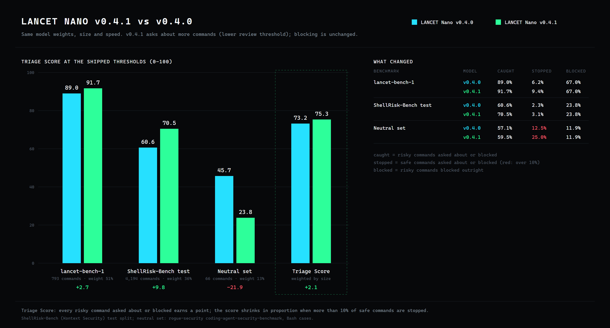

<h1 align="center">LANCET Nano</h1>
<p align="center">A local classifier for Bash command risk.</p>
<p align="center"><strong>v0.4.1 · 110M parameters · 111 MB · CPU INT8 ONNX · ~14 ms per command · offline</strong></p>

<p align="center">
  <a href="https://github.com/TannerMidd/LANCET-model/releases/tag/v0.4.1">Download v0.4.1</a> ·
  <a href="https://huggingface.co/spaces/fingerthief/lancet-nano">Try it in your browser</a> ·
  <a href="https://tannermidd.github.io/LANCET-model/">Website</a> ·
  <a href="bundle/MODEL_CARD.md">Model card</a> ·
  <a href="bundle/README.md">Usage</a> ·
  <a href="LICENSE.md">Licenses</a>
</p>

**Model: Apache-2.0. Runtime: MIT.** You may use, modify and redistribute it, including commercially, under the respective terms. Training data is not included or relicensed.

<p align="center"></p>

## What's new in v0.4.1

- **Same model, catches more.** v0.4.1 keeps v0.4.0's weights and lowers the `review` threshold, so it asks about more borderline commands. It never blocks more than v0.4.0.
- **Triage Score 75.3** (v0.4.0: 73.2). Every risky command asked about or blocked earns a point; the score shrinks when more than 10% of safe commands are stopped. Three benchmarks, weighted by size.
- **ShellRisk-Bench test split:** 70.5% of risky commands caught (v0.4.0: 60.6%), with 3.1% of safe commands stopped (2.3%).
- **Release benchmark:** 91.7% caught (89.0%), 9.4% of safe commands stopped (6.2%).
- **Trade-off:** more `review` prompts. On the small neutral third-party set, 6 of 24 safe commands are asked about (v0.4.0: 3).

<p align="center"></p>

## Results on the 793-command release benchmark

<p align="center"></p>

Each model was scored in a single pass on `lancet-bench-1`: 409 risky and 384 safe commands across 37 tool areas.

| | Nano v0.4.1 | Nano v0.4.0 | Nano v0.3.0 | Nano v0.2.0 | Jev (hosted) | Laya (local) |
|---|---:|---:|---:|---:|---:|---:|
| Risky caught | **91.7%** | 89.0% | 85.8% | 73.6% | 96.8% | 68.5% |
| Safe commands wrongly stopped | 9.4% | 6.2% | 5.5% | 6.2% | 7.8% | 37.8% |
| Risky **secrets** commands caught (112) | **77%** | 72% | 66% | 24% | 98% | 48% |
| AUROC | **0.974** | **0.974** | 0.962 | 0.896 | 0.982 | 0.718 |
| Parameters | 110 M | 110 M | 110 M | 35 M | undisclosed | 421 M |
| Runs on | CPU | CPU | CPU | CPU | hosted API | GPU |

<p align="center"></p>

Jev and Laya received task context; Nano sees only the command. More charts are on the [website](https://tannermidd.github.io/LANCET-model/).

## Quick start

Download the [release ZIP](https://github.com/TannerMidd/LANCET-model/releases/download/v0.4.1/lancet-v0.4.1-nano-cpu-int8.zip) and its [checksum](https://github.com/TannerMidd/LANCET-model/releases/download/v0.4.1/SHA256SUMS.txt). Verify the checksum and extract the ZIP. Then, inside the extracted directory (Python 3.12, Windows / PowerShell), run:

```powershell
python verify_bundle.py --strict
python -m venv .venv
.\.venv\Scripts\python.exe -m pip install -r requirements.txt
$env:OPENBLAS_NUM_THREADS = '1'
'{"command": "kubectl delete namespace prod", "shell": "bash"}' | .\.venv\Scripts\python.exe classify.py --model model
```

Send JSON lines with a `command` string and `shell` set to `bash`. Each input is classified as `risky`, `review` or `not_flagged`. Inputs are inert text and are **never executed**. No API key or network connection is needed after installation. See the [full instructions](bundle/README.md).

If you clone the repository instead of downloading the ZIP, install Git LFS, run `git lfs pull`, and use `bundle/`.

## How it was trained

LANCET Nano v0.4.1 uses the v0.4.0 weights: the Salesforce **CodeT5+ 220M** encoder, fine-tuned from its pinned upstream weights. It does not start from an earlier LANCET checkpoint.

Training labels come from **project authoring, documentation and source datasets, not model opinions**:
- the wording of human-written example descriptions in [tldr-pages](https://github.com/tldr-pages/tldr) (CC BY 4.0)
- AWS operation verbs and the `sensitive` output-field markings in [botocore](https://github.com/boto/botocore) service models (Apache-2.0), so commands that print credentials are risky
- reference examples from the Azure CLI, GitHub CLI (MIT), kubectl and Docker CLI (Apache-2.0)
- attack-technique and everyday developer commands from the [ShellRisk-Bench](https://huggingface.co/datasets/kontext-security/ShellRisk-Bench) training split, with its upstream labels
- LANCET's project-authored risky/safe pairs, a secrets family, a red-team corpus and its earlier evaluation suites (original labels)

No language model, hosted API or human labeler produced any training label. See the [model card](bundle/MODEL_CARD.md) and [source notices](bundle/THIRD-PARTY-NOTICES.md).

## Boundaries

- **Bash only.** Nano does not inspect the filesystem, fetched scripts or task context.
- Other shells, invalid input, more than 8,192 UTF-8 bytes or more than 512 tokens return `review`. Inputs are never silently truncated.
- **`not_flagged` is not execution authorization or a safety guarantee.**
- Secrets (77% caught, 112 cases) and network/remote-execution commands (73%, 22 cases) are its weakest areas on the release benchmark.

## Versions

- **v0.4.1 — LANCET Nano, CodeT5+ 220M** (current, pre-release): v0.4.0 with a lower review threshold.
- [v0.4.0 — LANCET Nano, CodeT5+ 220M](https://github.com/TannerMidd/LANCET-model/releases/tag/v0.4.0): the same weights with the stricter v0.4.0 thresholds.
- [v0.3.0 — LANCET Nano, CodeT5-base](https://github.com/TannerMidd/LANCET-model/releases/tag/v0.3.0): still available unchanged.
- [v0.2.0 — LANCET Nano, CodeT5-small](https://github.com/TannerMidd/LANCET-model/releases/tag/v0.2.0): smaller (36 MB) and faster (~3–6 ms).
- [v0.1.0 — LANCET Nano v0.1.0 (formerly V5)](https://github.com/TannerMidd/LANCET-model/releases/tag/v0.1.0).

## Credits

LANCET is built on Salesforce CodeT5+ by **Yue Wang, Hung Le, Akhilesh Deepak Gotmare, Nghi D. Q. Bui, Junnan Li and Steven C. H. Hoi**. Training commands come from the **tldr-pages** team and contributors, AWS **botocore**, the Azure CLI, GitHub CLI, kubectl and Docker CLI projects, **ShellRisk-Bench** by Kontext Security (with **Atomic Red Team** by Red Canary and **InternalAllTheThings**), plus the datasets credited in the notices. Runtime and LANCET contributions: **Tanner Middleton**.

See the [full credits](bundle/NOTICE.txt), [source notices](bundle/THIRD-PARTY-NOTICES.md) and [model changes](bundle/MODIFICATIONS.md).
