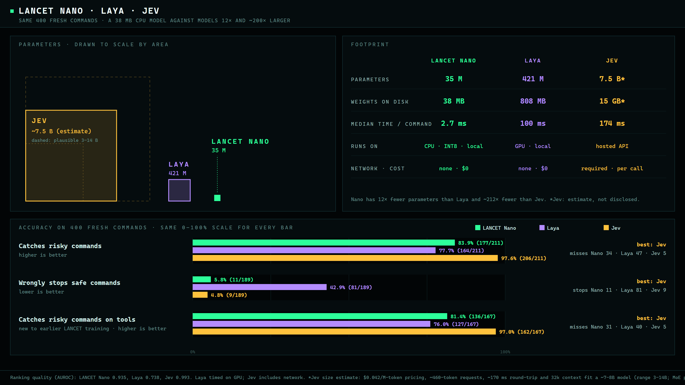

<h1 align="center">LANCET Nano</h1>
<p align="center">A small, local classifier for Bash command risk.</p>
<p align="center"><strong>35.3M parameters · 38 MB · CPU INT8 ONNX · ~3 ms per command · offline</strong></p>

<p align="center">
  <a href="https://github.com/TannerMidd/LANCET-model/releases/tag/v0.2.0">Download v0.2.0</a> ·
  <a href="https://tannermidd.github.io/LANCET-model/">Website</a> ·
  <a href="bundle/MODEL_CARD.md">Model card</a> ·
  <a href="bundle/README.md">Usage</a> ·
  <a href="LICENSE.md">Licenses</a>
</p>

**Model: Apache-2.0. Runtime: MIT.** You may use, modify and redistribute it, including commercially, under the respective terms. Training data is not included or relicensed.

<p align="center"></p>

## Results on 400 fresh commands

On a sealed diagnostic suite (211 risky, 189 benign, 85 tool families), each model was scored in a single pass:

| | LANCET Nano | Laya | Jev (hosted) |
|---|---:|---:|---:|
| Risky caught | 83.9% | 77.7% | 97.6% |
| Safe commands wrongly stopped | 5.8% | 42.9% | 4.8% |
| Parameters | 35 M | 421 M | ~7.5 B (estimate) |
| Median time per command | 2.7 ms (CPU) | 100 ms (GPU) | 174 ms (network) |

The suite's labels were written by the developer, an AI agent. This is diagnostic evidence, not independent acceptance. Jev's size is an estimate; it has not been disclosed. Jev and Laya received task context, while Nano sees only the command. The timings come from different hardware. [More charts and details](https://tannermidd.github.io/LANCET-model/).

## Quick start

Download the [release ZIP](https://github.com/TannerMidd/LANCET-model/releases/download/v0.2.0/lancet-v0.2.0-nano-cpu-int8.zip) and its [checksum](https://github.com/TannerMidd/LANCET-model/releases/download/v0.2.0/SHA256SUMS.txt). Verify the checksum, extract the ZIP, and inside the extracted directory (Python 3.12, Windows / PowerShell) run:

```powershell
python verify_bundle.py --strict
python -m venv .venv
.\.venv\Scripts\python.exe -m pip install -r requirements.txt
$env:OPENBLAS_NUM_THREADS = '1'
'{"command": "kubectl delete namespace prod", "shell": "bash"}' | .\.venv\Scripts\python.exe classify.py --model model
```

Send JSON lines with a `command` string and `shell` set to `bash`. Each input is classified as `risky`, `review` or `not_flagged`. Inputs are inert text and are **never executed**. No API key or network connection is needed after installation. See the [full instructions](bundle/README.md).

If you clone the repository instead of downloading the ZIP, install Git LFS, run `git lfs pull`, and use `bundle/`.

## How it was trained

LANCET Nano continues LANCET V5 (CodeT5-small) with class-balanced fine-tuning. The new training labels come from **documentation, not model opinions**:
- the wording of the human-written example descriptions in [tldr-pages](https://github.com/tldr-pages/tldr) (CC BY 4.0), such as "Delete…", "Destroy…" or "List…"
- AWS operation verbs from [botocore](https://github.com/boto/botocore) service models (Apache-2.0)

No language model, hosted API or human labeler produced any training label. See the [model card](bundle/MODEL_CARD.md).

## Boundaries

- **Bash only.** Nano does not inspect the filesystem, fetched scripts or task context.
- Other shells, invalid input, more than 8,192 UTF-8 bytes or more than 512 tokens return `review`. Inputs are never silently truncated.
- **`not_flagged` is not execution authorization or a safety guarantee.**
- Independent acceptance and human label adjudication remain unavailable.

## Versions

- **v0.2.0 — LANCET Nano** (current, pre-release).
- [v0.1.0 — V5](https://github.com/TannerMidd/LANCET-model/releases/tag/v0.1.0): the previous model, still available unchanged.

## Credits

LANCET is built on Salesforce CodeT5-small by **Yue Wang, Weishi Wang, Shafiq Joty and Steven C. H. Hoi**. Training commands come from the **tldr-pages** team and contributors and from AWS **botocore**, plus the datasets credited in the notices. Runtime and LANCET contributions: **Tanner Middleton**.

See the [full credits](bundle/NOTICE.txt), [source notices](bundle/THIRD-PARTY-NOTICES.md) and [model changes](bundle/MODIFICATIONS.md).
