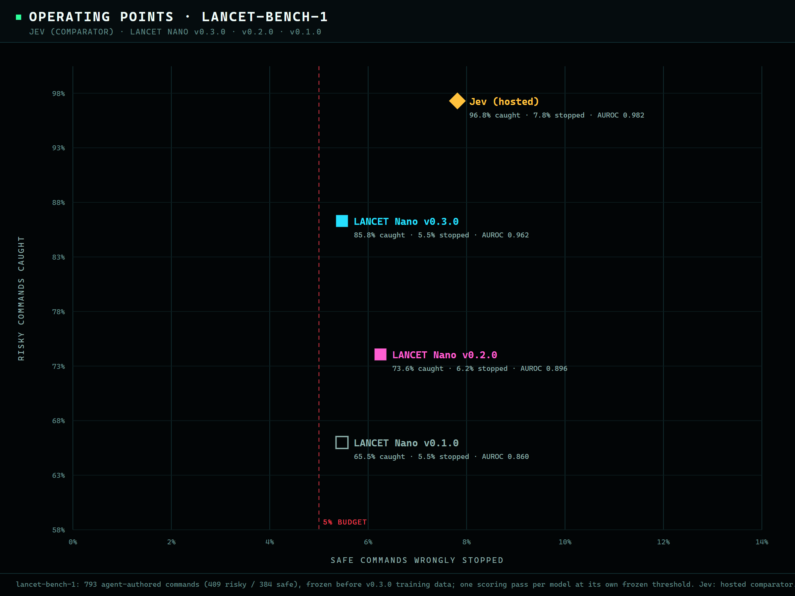

<h1 align="center">LANCET Nano</h1>
<p align="center">A local classifier for Bash command risk.</p>
<p align="center"><strong>v0.3.0 · 110M parameters · 111 MB · CPU INT8 ONNX · ~22 ms per command · offline</strong></p>

<p align="center">
  <a href="https://github.com/TannerMidd/LANCET-model/releases/tag/v0.3.0">Download v0.3.0</a> ·
  <a href="https://huggingface.co/spaces/fingerthief/lancet-nano">Try it in your browser</a> ·
  <a href="https://tannermidd.github.io/LANCET-model/">Website</a> ·
  <a href="bundle/MODEL_CARD.md">Model card</a> ·
  <a href="bundle/README.md">Usage</a> ·
  <a href="LICENSE.md">Licenses</a>
</p>

**Model: Apache-2.0. Runtime: MIT.** You may use, modify and redistribute it, including commercially, under the respective terms. Training data is not included or relicensed.

<p align="center"></p>

## Results on the 793-command release benchmark

Each model was scored in a single pass on `lancet-bench-1`: 409 risky and 384 safe commands across 37 tool areas. The benchmark was frozen and screened against all training data before v0.3.0's training data existed.

| | Nano v0.3.0 | Nano v0.2.0 | Nano v0.1.0 | Jev (hosted) |
|---|---:|---:|---:|---:|
| Risky caught | **85.8%** | 73.6% | 65.5% | 96.8% |
| Safe commands wrongly stopped | **5.5%** | 6.2% | 5.5% | 7.8% |
| Risky **secrets** commands caught (112) | **66%** | 24% | 14% | 98% |
| Parameters | 110 M | 35 M | 35 M | undisclosed |
| On disk | 111 MB | 36 MB | 36 MB | hosted |

- **Benchmark caveat:** the benchmark's labels were written by the developer, an AI agent, so this is diagnostic evidence, not independent acceptance.
- **Outside check:** on the upstream ShellRisk sets, which are not agent-authored, v0.3.0 catches about as many risky commands as v0.2.0 and stops about a third fewer safe ones. It is weaker on the smaller holdout set.
- **Release status:** v0.3.0 was released by owner exception after one overly strict preregistered check failed. See the [model card](bundle/MODEL_CARD.md) and [More charts](https://tannermidd.github.io/LANCET-model/).

## Quick start

Download the [release ZIP](https://github.com/TannerMidd/LANCET-model/releases/download/v0.3.0/lancet-v0.3.0-nano-cpu-int8.zip) and its [checksum](https://github.com/TannerMidd/LANCET-model/releases/download/v0.3.0/SHA256SUMS.txt). Verify the checksum and extract the ZIP. Then, inside the extracted directory (Python 3.12, Windows / PowerShell), run:

```powershell
python verify_bundle.py --strict
python -m venv .venv
.\.venv\Scripts\python.exe -m pip install -r requirements.txt
$env:OPENBLAS_NUM_THREADS = '1'
'{"command": "kubectl delete namespace prod", "shell": "bash"}' | .\.venv\Scripts\python.exe classify.py --model model
```

Send JSON lines with a `command` string and `shell` set to `bash`. Each input is classified as `risky`, `review` or `not_flagged`. Inputs are inert text and are **never executed**. No API key or network connection is needed after installation. See the [full instructions](bundle/README.md).

If you clone the repository instead of downloading the ZIP, install Git LFS, run `git lfs pull`, and use `bundle/`.

## How it was trained

LANCET Nano v0.3.0 fine-tunes the Salesforce **CodeT5-base** encoder from its pinned upstream weights, with class-balanced sampling. It does not start from an earlier LANCET checkpoint.

Training labels come from **project authoring and documentation, not model opinions**:
- the wording of human-written example descriptions in [tldr-pages](https://github.com/tldr-pages/tldr) (CC BY 4.0)
- AWS operation verbs and the `sensitive` output-field markings in [botocore](https://github.com/boto/botocore) service models (Apache-2.0), so commands that print credentials are risky
- reference examples from the Azure CLI, GitHub CLI (MIT), kubectl and Docker CLI (Apache-2.0)
- LANCET's project-authored risky/safe pairs, a secrets family, and its earlier, now-retired agent-authored evaluation suites (original labels)

No language model, hosted API or human labeler produced any training label. See the [model card](bundle/MODEL_CARD.md).

## Boundaries

- **Bash only.** Nano does not inspect the filesystem, fetched scripts or task context.
- Other shells, invalid input, more than 8,192 UTF-8 bytes or more than 512 tokens return `review`. Inputs are never silently truncated.
- **`not_flagged` is not execution authorization or a safety guarantee.**
- Secrets detection improved but still trails the hosted comparator (66% vs 98%).
- Independent acceptance and human label adjudication remain unavailable.

## Versions

- **v0.3.0 — LANCET Nano, CodeT5-base** (current, pre-release).
- [v0.2.0 — LANCET Nano, CodeT5-small](https://github.com/TannerMidd/LANCET-model/releases/tag/v0.2.0): smaller (36 MB) and faster (~3–6 ms); still available unchanged.
- [v0.1.0 — LANCET Nano v0.1.0 (formerly V5)](https://github.com/TannerMidd/LANCET-model/releases/tag/v0.1.0).

## Credits

LANCET is built on Salesforce CodeT5 by **Yue Wang, Weishi Wang, Shafiq Joty and Steven C. H. Hoi**. Training commands come from the **tldr-pages** team and contributors, AWS **botocore**, and the Azure CLI, GitHub CLI, kubectl and Docker CLI projects, plus the datasets credited in the notices. Runtime and LANCET contributions: **Tanner Middleton**.

See the [full credits](bundle/NOTICE.txt), [source notices](bundle/THIRD-PARTY-NOTICES.md) and [model changes](bundle/MODIFICATIONS.md).
