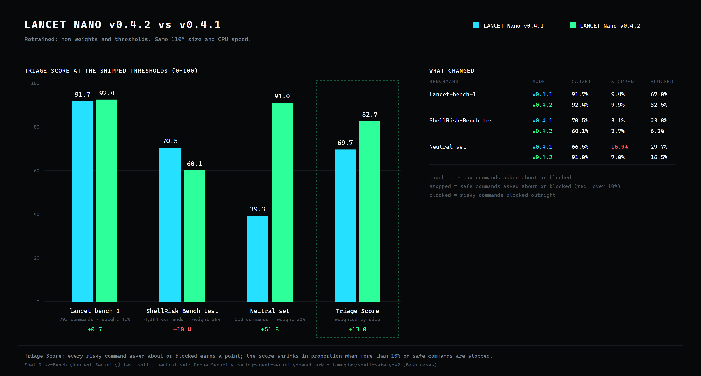

<h1 align="center">LANCET Nano</h1>
<p align="center">A local classifier for Bash command risk.</p>
<p align="center"><strong>v0.4.2 · 110M parameters · 111 MB · CPU INT8 ONNX · ~14 ms per command · offline</strong></p>

<p align="center">
  <a href="https://github.com/TannerMidd/LANCET-model/releases/tag/v0.4.2">Download v0.4.2</a> ·
  <a href="https://huggingface.co/spaces/fingerthief/lancet-nano">Try it in your browser</a> ·
  <a href="https://tannermidd.github.io/LANCET-model/">Website</a> ·
  <a href="bundle/MODEL_CARD.md">Model card</a> ·
  <a href="bundle/README.md">Usage</a> ·
  <a href="benchmarks/lancet-bench-1/">Benchmark data</a> ·
  <a href="LICENSE.md">Licenses</a>
</p>

**Model: Apache-2.0. Runtime: MIT.** You may use, modify and redistribute it, including commercially, under the respective terms. Training data is not included or relicensed.

<p align="center"></p>

## What's new in v0.4.2

- **Triage Score 82.7** (v0.4.1: 69.7), the best of any guard tested. Every risky command asked about or blocked earns a point; the score shrinks when more than 10% of safe commands are stopped. Three benchmarks (5,500 commands), weighted by size.
- **A newly trained model.** Fine-tuned again from the pinned CodeT5+ 220M base on a larger, more balanced mix (43,418 rows), adding the Shell Safety v2 training split and new contrast sets of agent-style, `exec`-style and shell-escape commands with safe look-alikes.
- **Far fewer interruptions on everyday commands.** On the 513-command neutral set it catches 91.0% of risky commands (v0.4.1: 66.5%) and stops only 7.0% of safe ones (16.9%).
- **Release benchmark:** 92.4% caught (91.7%), 9.9% of safe commands stopped (9.4%).
- **ShellRisk-Bench test split:** 60.1% caught (70.5%), 2.7% of safe commands stopped (3.1%).
- **More asking, less blocking:** more of the risky commands it catches come back as `review` rather than `risky`.

<p align="center"></p>

## Triage Score by release

<p align="center"></p>

Every LANCET Nano release scored the same way, at its shipped setting, on the same three benchmarks.

## Triage Score across three benchmarks

<p align="center"></p>

Each guard is scored once at its shipped setting on three benchmarks (5,500 commands): lancet-bench-1 (793), the ShellRisk-Bench test split (4,194) and a neutral set of outside-party commands (513). Every risky command asked about or blocked earns a point; the score shrinks in proportion when more than 10% of safe commands are stopped. The three are combined by size (41% / 29% / 30%). Risky caught and safe stopped are combined the same way.

| Guard | Triage Score | lancet-bench-1 | ShellRisk test | Neutral set | Risky caught | Safe stopped | Parameters | Runs on |
|---|---:|---:|---:|---:|---:|---:|---:|---|
| **LANCET Nano v0.4.2** | **82.7** | 92.4 | 60.1 | 91.0 | 82.7% | 6.9% | 110 M | CPU, local |
| LANCET Nano v0.4.1 | 69.7 | 91.7 | 70.5 | 39.3 | 77.9% | 9.9% | 110 M | CPU, local |
| LANCET Nano v0.4.0 | 69.2 | 89.0 | 60.6 | 50.8 | 70.7% | 6.5% | 110 M | CPU, local |
| LANCET Nano v0.3.0 | 61.7 | 85.8 | 46.6 | 43.6 | 66.5% | 8.1% | 110 M | CPU, local |
| LANCET Nano v0.1.0 | 55.4 | 65.5 | 45.6 | 51.0 | 61.5% | 8.5% | 35 M | CPU, local |
| LANCET Nano v0.2.0 | 55.3 | 73.6 | 47.7 | 37.9 | 64.4% | 10.6% | 35 M | CPU, local |
| Jev | 58.6 | 96.8 | 32.4 | 32.1 | 88.6% | 18.4% | undisclosed | hosted API |
| Kestrel | 37.8 | 11.5 | 100.0 | 14.0 | 76.1% | 38.7% | — | local |
| ModernBERT bash | 25.9 | 15.5 | 40.9 | 25.6 | 67.0% | 32.6% | 150 M | local |
| bash-classify | 13.8 | 11.5 | 16.8 | 14.0 | 91.9% | 68.9% | rules | local |
| sh-guard | 11.2 | 10.1 | 12.1 | 11.7 | 97.6% | 88.1% | rules | local |
| dcg | 7.4 | 2.9 | 4.1 | 16.5 | 7.4% | 1.6% | rules | local |

Jev received task context; the others see only the command. Per-benchmark columns are each benchmark's own Triage Score (0-100).

<p align="center"></p>

Detail by tool area on lancet-bench-1. More charts are on the [website](https://tannermidd.github.io/LANCET-model/).

## Quick start

Download the [release ZIP](https://github.com/TannerMidd/LANCET-model/releases/download/v0.4.2/lancet-v0.4.2-nano-cpu-int8.zip) and its [checksum](https://github.com/TannerMidd/LANCET-model/releases/download/v0.4.2/SHA256SUMS.txt). Verify the checksum and extract the ZIP. Then, inside the extracted directory (Python 3.12, Windows / PowerShell), run:

```powershell
python verify_bundle.py --strict
python -m venv .venv
.\.venv\Scripts\python.exe -m pip install -r requirements.txt
$env:OPENBLAS_NUM_THREADS = '1'
'{"command": "kubectl delete namespace prod", "shell": "bash"}' | .\.venv\Scripts\python.exe classify.py --model model
```

Send JSON lines with a `command` string and `shell` set to `bash`. Each input is classified as `risky`, `review` or `not_flagged`. Inputs are inert text and are **never executed**. No API key or network connection is needed after installation. See the [full instructions](bundle/README.md).

If you clone the repository instead of downloading the ZIP, install Git LFS, run `git lfs pull`, and use `bundle/`.

## How it was trained

LANCET Nano v0.4.2 is the Salesforce **CodeT5+ 220M** encoder, fine-tuned from its pinned upstream weights. It does not start from an earlier LANCET checkpoint.

Training labels come from **project authoring, documentation and source datasets, not model opinions**:
- the wording of human-written example descriptions in [tldr-pages](https://github.com/tldr-pages/tldr) (CC BY 4.0)
- AWS operation verbs and the `sensitive` output-field markings in [botocore](https://github.com/boto/botocore) service models (Apache-2.0), so commands that print credentials are risky
- reference examples from the Azure CLI, GitHub CLI (MIT), kubectl and Docker CLI (Apache-2.0)
- attack-technique and everyday developer commands from the [ShellRisk-Bench](https://huggingface.co/datasets/kontext-security/ShellRisk-Bench) training split, with its upstream labels
- the [Shell Safety v2](https://huggingface.co/datasets/tomngdev/shell-safety-v2) training split (MIT), with its author's allow/deny labels
- LANCET's project-authored risky/safe pairs, contrast sets of agent-style, `exec`-style and shell-escape commands, a secrets family, a red-team corpus and its earlier evaluation suites (original labels)

No language model, hosted API or human labeler produced any training label. See the [model card](bundle/MODEL_CARD.md) and [source notices](bundle/THIRD-PARTY-NOTICES.md).

## Boundaries

- **Bash only.** Nano does not inspect the filesystem, fetched scripts or task context.
- Other shells, invalid input, more than 8,192 UTF-8 bytes or more than 512 tokens return `review`. Inputs are never silently truncated.
- **`not_flagged` is not execution authorization or a safety guarantee.**
- Secrets (78% caught, 112 cases) and network/remote-execution commands (86%, 22 cases) are its weakest areas on the release benchmark.

## Benchmark data

- [**lancet-bench-1**](benchmarks/lancet-bench-1/): 793 Bash commands (409 risky, 384 benign) across 37 tool areas, with labels, rationales and results for 14 command guards. It was LANCET's release benchmark until 2026-09-29, when it was retired in favour of a larger successor. It is free to use (MIT). The commands are test data; do not run them.

## Versions

- **v0.4.2 — LANCET Nano, CodeT5+ 220M** (current, pre-release): newly trained; Triage Score 82.7.
- [v0.4.1 — LANCET Nano, CodeT5+ 220M](https://github.com/TannerMidd/LANCET-model/releases/tag/v0.4.1): v0.4.0 with a lower review threshold.
- [v0.4.0 — LANCET Nano, CodeT5+ 220M](https://github.com/TannerMidd/LANCET-model/releases/tag/v0.4.0): the same weights with the stricter v0.4.0 thresholds.
- [v0.3.0 — LANCET Nano, CodeT5-base](https://github.com/TannerMidd/LANCET-model/releases/tag/v0.3.0): still available unchanged.
- [v0.2.0 — LANCET Nano, CodeT5-small](https://github.com/TannerMidd/LANCET-model/releases/tag/v0.2.0): smaller (36 MB) and faster (~3–6 ms).
- [v0.1.0 — LANCET Nano v0.1.0 (formerly V5)](https://github.com/TannerMidd/LANCET-model/releases/tag/v0.1.0).

## Credits

LANCET is built on Salesforce CodeT5+ by **Yue Wang, Hung Le, Akhilesh Deepak Gotmare, Nghi D. Q. Bui, Junnan Li and Steven C. H. Hoi**. Training commands come from the **tldr-pages** team and contributors, AWS **botocore**, the Azure CLI, GitHub CLI, kubectl and Docker CLI projects, **ShellRisk-Bench** by Kontext Security (with **Atomic Red Team** by Red Canary and **InternalAllTheThings**), **Shell Safety v2** by tomngdev, plus the datasets credited in the notices. Runtime and LANCET contributions: **Tanner Middleton**.

See the [full credits](bundle/NOTICE.txt), [source notices](bundle/THIRD-PARTY-NOTICES.md) and [model changes](bundle/MODIFICATIONS.md).
